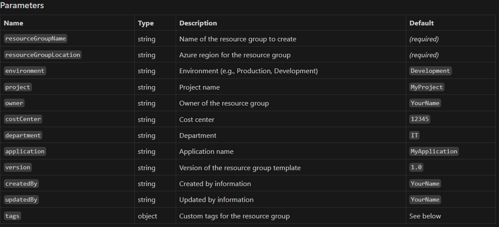
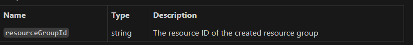

### Resource Group Bicep Module
## Overview
This Bicep module creates an Azure Resource Group at the subscription scope and applies a set of customizable tags for governance, tracking, and automation.



Tags Parameter
The `tags` parameter is an object containing default tags based on other parameters.
You can override or extend these tags by passing a custom object, using the union() function if needed.

## Example: Adding Custom Tags

```
module rg 'resourceGroup.bicep' = {
  name: 'createRG'
  params: {
    resourceGroupName: 'myRG'
    resourceGroupLocation: 'westeurope'
    tags: union({
      businessUnit: 'Finance'
      priority: 'High'
    }, tags)
  }
}
```
## Outputs


## Usage Example

```
module rg 'resourceGroup.bicep' = {
  name: 'createRG'
  params: {
    resourceGroupName: 'myRG'
    resourceGroupLocation: 'westeurope'
    environment: 'Production'
    owner: 'Alice'
    tags: union({
      businessUnit: 'Finance'
      priority: 'High'
    }, tags)
  }
}
```
## Notes
All parameters except `tags` have default values and can be overridden.
Use the `tags` parameter to add or override tags for governance and tracking.
The module outputs the resource group ID for use in other modules.