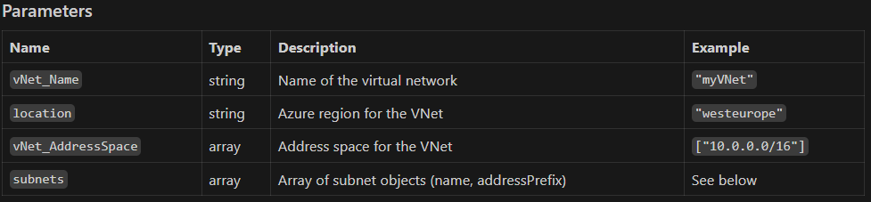

### Virtual Network Bicep Module
## Overview
This Bicep module deploys an Azure Virtual Network (VNet) with a configurable address space and a variable number of subnets.
You can specify subnet names and address prefixes as parameters.



Subnet Object Format
Each subnet object should have:

`name`: Name of the subnet
`addressPrefix`: CIDR address prefix for the subnet

## Example:

```
subnets: [
  {
    name: 'Subnet-1'
    addressPrefix: '10.0.0.0/24'
  }
  {
    name: 'Subnet-2'
    addressPrefix: '10.0.1.0/24'
  }
]
```
## Usage Example

```
module vnetModule 'vNet.bicep' = {
  name: 'deployVNet'
  params: {
    vNet_Name: 'myVNet'
    location: 'westeurope'
    vNet_AddressSpace: [
      '10.0.0.0/16'
    ]
    subnets: [
      {
        name: 'Subnet-1'
        addressPrefix: '10.0.0.0/24'
      }
      {
        name: 'Subnet-2'
        addressPrefix: '10.0.1.0/24'
      }
    ]
  }
}
```
Notes
You can specify between 1 and 10 subnets in the `subnets` array.
Each subnet must have a unique address prefix within the VNet address space.
The module uses parameter validation to enforce subnet count and allowed values.
